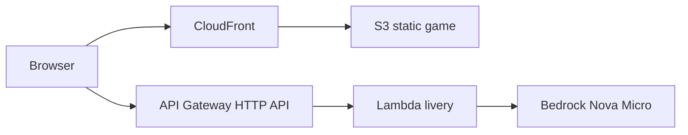

# Weekend Creative Challenge: Midnight City

**Tag:** `#creative-expression`

**Live app:** https://d13yfjiopq5e5t.cloudfront.net  
**Source:** https://github.com/Praneel7015/MidnightCity

---

## Vision & What the App Does

Midnight City is a browser arcade racer that tries to bottle one feeling: dropping a loud car onto a glowing night circuit and chasing the vanishing point. It is a toy, not a sim. You paint a coupe in the garage, tap **Drop In**, and drive a long closed loop that runs through a stylized downtown, a neon-kerbed sweep, and a wide tunnel. The camera sits behind the car the way a Need for Speed chase cam does — high, a little late, looking past the hood into the next corner.

The creative output is the race itself: headlights raking wet-looking asphalt, underglow on the tarmac, a heading-up minimap in the corner, lap times on the HUD. A second creative beat lives in the garage. **AI Paint Job** asks Amazon Bedrock (Nova Micro) for a named livery — body color, rims, underglow, a short tagline — and applies it to the 3D car immediately. If Bedrock is asleep, local presets still remix the car, so the toy never hard-depends on an API to be fun.

It is built for a laptop keyboard and a phone thumb. WASD plus Space to brake, R to reset. On coarse pointers, on-screen GAS / BRAKE / steer pads appear. That was the whole pitch: one creative job, playable in a weekend, hosted on AWS Free Tier.

Screenshots from the local dry-run (garage, chase cam + HUD, skyline) live in `docs/article-images/`.

---

## How I Built It

I scoped this harder than the daydream. A rigid-body physics engine is how 3D racers go from “fun” to “the car is in orbit.” Midnight City uses an arcade vehicle: speed lives along heading, steer rate falls off as you go faster, Space dumps speed, reverse is capped. The only collision is the left and right track rails, and it is a **slide**, not a pin. Buildings, lamps, the tunnel shell, and the skybox have no colliders. If you stall against a kerb for a second, the car is nudged back toward the centerline. Reset always faces the spline tangent.

The circuit is a closed Catmull-Rom spline with 56 waypoints and hundreds of ribbon samples, wide enough that a phone player can stay on tarmac. Road mesh, neon kerbs, a start/finish chevron, and a tunnel that is wider than the car are generated from that spline so the track cannot “forget” to render. City buildings are instanced boxes parked **outside** a clearance gap, plus a downtown cluster in the infield — decoration, never a wall.

The camera is a spring offset behind and above the car. The minimap is not a fake CSS drawing: the same WebGL renderer scissor-renders an orthographic heading-up view after the chase pass, with a bright circuit line and a chevron for the player.

I reused the serverless shape I already knew from WeekAhead: Vite for the frontend, AWS CDK for a Lambda + HTTP API + S3 + CloudFront stack, Nova Micro for the one generative trick. Local play is `npm install && npm run dev`. No AWS keys, no Docker. `npm run dry-run` builds the game and checks that the spline is closed, the road is wide, the skybox generator exists, and `dist/index.html` was emitted.

Challenges and how I got past them:

- **Uncontrollable cars.** I refused a general physics engine. Arcade integration plus rail-glide kept WASD honest.
- **Black or missing worlds.** Lights are hemisphere + moon + a handful of street point lights. Materials are `MeshStandardMaterial`. The sky is a procedural equirectangular canvas (indigo to city-glow horizon and stars) assigned as `scene.background` and `scene.environment` so the car actually reflects the night. A huge ground disc stops the clear-color void.
- **Kenney GLB URLs.** Kenney’s Car Kit is CC0, but this environment could not pull a stable raw GLB. I vendored a Poly Haven CC0 asphalt texture and shipped a procedural coupe with a GLTF loader fallback if you drop `car.glb` into `public/assets/`.
- **Mobile thumbs covering the map.** Minimap moves to the top-left on coarse pointers; touch pads sit on the bottom edge.

---

## AWS Services Used / Architecture Overview

Midnight City is a static Three.js game with one optional generative endpoint.

- **Amazon S3** — hosts the built Vite app (`frontend/dist`).
- **Amazon CloudFront** — HTTPS CDN in front of the bucket, SPA-friendly 404 → `index.html`.
- **AWS Lambda** — `midnight-city-livery` calls Bedrock and always returns a livery JSON (fallback JSON if the model errors).
- **Amazon API Gateway (HTTP API)** — `POST /livery` (CORS open for the game origin).
- **Amazon Bedrock (Nova Micro)** — APAC inference profile `apac.amazon.nova-micro-v1:0`, same pattern as WeekAhead.
- **AWS CDK** — `infra/` is the source of truth.

The race loop never waits on AWS. Bedrock only paints the car. That keeps Free Tier spend tiny and keeps the qualifying “it works” demo intact if model access hiccups.

---

## What I Learned

I learned that a chase camera is a product decision, not a `lookAt` call: too close and you eat the hood, too stiff and you get motion sick, too loose and you lose the car. Spring-follow with a look-ahead target was the first setup that felt like the games I was chasing.

I also learned to treat generative AI as garnish. Nova is perfect for naming a livery and picking three hex colors. It is a bad physics engine. Putting the model behind a Lambda that **cannot fail the player** (it returns a canned paint job on error) made the garage feel magical without making the weekend fragile.

On the AWS side, repeating the WeekAhead CDK pattern — `NodejsFunction` ESM bundling, HTTP API, S3 + CloudFront OAC — was faster than inventing a new topology. The new skill was getting a spline-meshed world to light correctly in Three.js: vertex winding, fog density on a kilometer-scale loop, and environment maps from a canvas texture.

The unglamorous lesson: vendor assets. A 700 KB CC0 asphalt JPEG in `public/assets/` plus a procedural sky means `npm run dev` works on an airplane. That is the difference between a demo you can dry-run and a demo that 404s its skybox.

---

## Link to App or Repo

- **Deployed game:** https://d13yfjiopq5e5t.cloudfront.net
- **Livery API:** https://gveu8689b5.execute-api.ap-south-1.amazonaws.com/livery
- **Source:** https://github.com/Praneel7015/MidnightCity
- **Local:** `npm install && npm run dev` → http://localhost:5173
